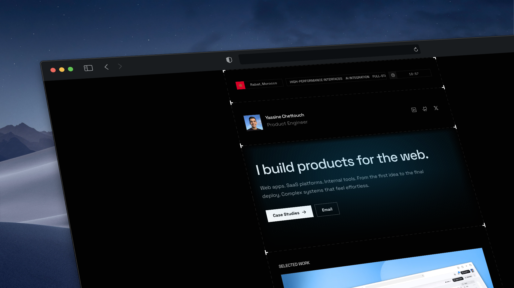

# Yaschet's Website



**Software Engineer Website**. Built with Next.js 16, Tailwind CSS v4, and TypeScript. Focused on performance, type safety, and rigorous design constraints.

## Tech Stack

High-performance stack enforcing type safety and layout stability.

| Domain | Technology | Rationale |
| :--- | :--- | :--- |
| **Framework** | **Next.js 16.1** | App Router, React Server Components (RSC), Turbopack. |
| **Styling** | **Tailwind CSS v4** | Zero-runtime CSS, OKLCH color spaces, CSS Variables. |
| **Language** | **TypeScript 5** | Strict Mode, Zod validation for all data boundaries. |
| **Content** | **Contentlayer2** | Type-safe MDX content pipeline. |
| **Motion** | **Framer Motion 12** | Physics-based animations and shared layout transitions. |
| **State** | **TanStack Query** | Server-state management with optimistic UI patterns. |
| **Tooling** | **Biome** | Rust-based high-performance linter and formatter. |

## Key Features

- **Strict Design System**: Custom 12-column grid system with fixed typography scales.
- **Type Safety**: End-to-end type safety from database to UI components.
- **Performance**: Optimized for Core Web Vitals with zero layout shift.
- **Verification**: automated formatting and type checking via `pnpm verify`.

## Project Structure

```bash
├── content/              # MDX Data Source (Projects, Case Studies)
├── docs/                 # Engineering Guidelines (Single Source of Truth)
│   ├── AI_GUIDELINES.md  # Rules for AI Agents
│   └── design-system.md  # Design constraints & tokens
├── public/               # Static Assets
├── src/
│   ├── app/              # Next.js App Router (Routes & Layouts)
│   ├── components/
│   │   ├── features/     # Domain-specific components (e.g., ContactForm)
│   │   ├── forms/        # Form logic & Zod schemas
│   │   ├── layout/       # Structural shell (Header, Footer, Hero)
│   │   └── ui/           # Design System Primitives (Button, Input)
│   └── lib/              # Utilities (Physics, Fonts, Schemas)
└── tailwind.config.ts    # Design Tokens & Theme Configuration
```

## Local Development

```bash
# Install dependencies
pnpm install

# Run development server (Turbopack)
pnpm dev

# Verify codebase health (Typecheck + Lint)
pnpm verify

# Build for production
pnpm build
```

## License

Licensed under the MIT License. Check the [LICENSE](LICENSE) file for details.
