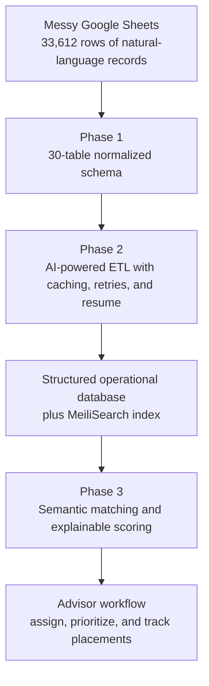

export const metadata = {
	title: "Explainable Program Matching Engine",
	description:
		"Solo-built operational rebuild for a study-abroad consultancy: schema redesign, AI-powered ETL, and explainable ranking across 33,612 spreadsheet rows.",
	subtitle:
		"Phoenix: three deep dives into a normalized data model, resumable AI import pipeline, and real-time semantic program matching.",
	date: "2025-06-08",
	role: "Sole Engineer (Architecture, Backend, Frontend, DevOps, QA)",
	domain: "Education Operations / Internal Tools",
	stack: [
		"Laravel 11",
		"PHP 8.3",
		"Livewire 3",
		"MariaDB",
		"Redis",
		"MeiliSearch",
		"OpenAI",
		"Laravel Excel",
		"Pest",
	],
	coverImages: [
		"/images/clearway-phoenix/phase-3/p3-01-semantic-search-machine-learning.png",
		"/images/clearway-phoenix/phase-1/01-programs-table.png",
		"/images/clearway-phoenix/phase-2/p2-archive-dashboard-hero.png",
		"/images/clearway-phoenix/phase-3/p3-02-match-score-positive-breakdown.png",
		"/images/clearway-phoenix/phase-3/p3-06-assigned-programs-workflow.png",
	],
	tech: [
		"Laravel",
		"Livewire",
		"MariaDB",
		"Redis",
		"MeiliSearch",
		"OpenAI",
		"Laravel Excel",
		"Alpine.js",
		"ETL",
		"Semantic Search",
	],
	seoKeywords: [
		"Internal tools",
		"Operational software",
		"AI ETL",
		"Semantic matching",
		"Program recommendations",
		"Study abroad software",
		"Explainable scoring",
		"System design",
	],
	featured: true,
	listed: true,
	status: "Shipped / In Active Use",
	sortOrder: 1,
};

## System Demonstration

<Video
	playbackId="jzmky2yBDeGf9P9n6PKf01C2ExZIxog5mGMSwaX9TkY00"
	poster="/images/clearway-phoenix/phase-3/p3-01-semantic-search-machine-learning.png"
	loop={false}
	muted={false}
	caption="Phase 3 demo: semantic search, explainable match scoring, and the assignment workflow used by advisors."
	metadata={{
		video_title:
			"Program Matching Engine - AI-Powered University Search for Study Abroad Advisors",
		video_id: "xtTqif1ocZV012eqCH1t28701lO2y00t01NNirLbyIidmJA",
	}}
/>

Clearway Phoenix started after a simpler V1 matching calculator failed. The original system could only do literal keyword filtering, which meant a student looking for `economy` would miss programs labeled `business` or `finance`. That failure exposed the real problem: the agency was trying to make high-stakes placement decisions from messy spreadsheets, shallow logic, and manual cross-referencing.

I rebuilt the workflow as a three-phase system: a normalized data model, a resumable AI-powered import pipeline, and a real-time matching engine that could be used during live advisor calls.

| Scope | Outcome |
| --- | --- |
| Students waiting on recommendations | 400+ |
| Spreadsheet rows in the operating dataset | 33,612 |
| Programs ranked in the live engine | 19,299 |
| Completed ETL run cost | $11.05 |
| Recommendation latency | Under 1 second |
| Build model | 16 weeks, solo |



## 01. Deep Dive: Schema Redesign

The first decision was sequencing. I did not start by importing data. I started by building the place that data needed to live.

The legacy system was too flat to support intelligent matching. Critical business rules lived inside notes fields: nationality restrictions, scholarship variants, language thresholds, fee structures, and accommodation details. That makes data display possible, but it makes reasoning impossible.

So Phase 1 rebuilt the foundation as a normalized schema across universities, programs, scholarships, locations, and reference data. The goal was not elegance for its own sake. The goal was queryability. If a future recommendation engine needed to reason about grade requirements, scholarship coverage, or field alignment, those things had to exist as real structured relationships first.

<Image
	src="/images/clearway-phoenix/phase-1/14-review-board.png"
	alt="Phase 1 review board showing the polished Phoenix schema redesign surfaces"
	caption="Phase 1 produced a full operational surface, not just migrations: program management, university modeling, settings systems, and detailed read views."
	priority={true}
/>

| Decision | Why it mattered |
| --- | --- |
| 30-table normalized schema | Turned notes-field chaos into data the platform could actually query, filter, and score. |
| Major categories | Gave the future matching engine a structural relevance axis beyond raw keywords. |
| Typed pivots for requirements | Kept thresholds on the actual relationship where they belonged. |
| Embeddings stored on program rows | Avoided premature vector infrastructure while preserving semantic capability. |
| AI autofill in admin forms | Reduced dependency on manual operator discipline during ongoing maintenance. |

Phase 1 also had to be usable by a non-technical team. That meant the work did not stop at migrations and models. It expanded into a full Livewire CRUD system for programs, universities, settings, language templates, scholarship types, and supporting reference entities. The system had to make clean data easier to enter than dirty data.

<Gallery
	images={[
		"/images/clearway-phoenix/phase-1/01-programs-table.png",
		"/images/clearway-phoenix/phase-1/02-programs-modal-overview.png",
		"/images/clearway-phoenix/phase-1/03-programs-modal-grade-requirements.png",
		"/images/clearway-phoenix/phase-1/04-programs-modal-language-requirements.png",
		"/images/clearway-phoenix/phase-1/05-universities-table.png",
		"/images/clearway-phoenix/phase-1/06-universities-modal-details.png",
		"/images/clearway-phoenix/phase-1/07-universities-modal-scoring.png",
		"/images/clearway-phoenix/phase-1/08-universities-modal-fees.png",
		"/images/clearway-phoenix/phase-1/09-university-detail-overview.png",
		"/images/clearway-phoenix/phase-1/10-settings-majors-categories.png",
		"/images/clearway-phoenix/phase-1/11-settings-language-tests.png",
		"/images/clearway-phoenix/phase-1/12-settings-test-templates.png",
		"/images/clearway-phoenix/phase-1/13-settings-scholarship-types-categories.png",
	]}
	captions={[
		"Programs table backed by the normalized program schema.",
		"Program modal overview with typed intake data.",
		"Program grade requirements modeled as structured relationships.",
		"Program language requirements captured as queryable constraints.",
		"Universities table surfacing data that used to live in notes fields.",
		"University modal for normalized detail capture.",
		"University scoring inputs exposed as typed fields instead of prose.",
		"University fee structure captured as structured financial data.",
		"University detail page proving the schema could support a rich read surface.",
		"Majors and categories became the semantic backbone of matching.",
		"Language tests were templated so the team stopped inventing formats row by row.",
		"Test templates reduced intake friction and normalized requirements.",
		"Scholarship types and categories turned free-text awards into structured records.",
	]}
	caption="Phase 1 gallery, ordered from the polished source set."
/>

What mattered most here was judgment, not volume. The difficult part was not creating many tables. The difficult part was deciding what deserved first-class structure and what should remain derived or auxiliary.

## 02. Deep Dive: AI-Powered ETL Pipeline

<Video
	playbackId="jV98n3wHiD2wuEPf1ldpdK1sumV7klWyon6OtIdYRsw"
	poster="/images/clearway-phoenix/phase-2/p2-archive-dashboard-hero.png"
	loop={false}
	muted={false}
	caption="Phase 2 demo: the Phoenix import pipeline running as an operator-grade ETL workflow with state, retries, and cost visibility."
	metadata={{
		video_title:
			"AI-Powered ETL Pipeline - Turning Messy Spreadsheets into a Queryable Database",
		video_id: "uW77A02svNCBHvN02ZG1vu01MmZKnWl01Ci00pSti01kCK00JM",
	}}
/>

Once the schema existed, the next bottleneck was the source data itself. The agency's spreadsheets were not clean exports. They were the operating system: inconsistent, human-written, partially structured, and constantly changing.

That made manual migration the wrong answer. The problem was not moving rows from one database to another. The problem was reconstructing meaning from natural-language spreadsheet cells and landing that meaning inside a relational model without losing resumability or operational control.

The pipeline processes all four sheets in sequence and persists progress after every row. If a long-running import dies, it resumes from the last checkpoint instead of replaying the entire job. Every AI transformation is cached by row hash, which is why repeated imports of unchanged data do not keep re-spending API cost.

| ETL metric | Value |
| --- | --- |
| Universities | 175 |
| Accommodations | 590 |
| Programs | 19,299 |
| Scholarships | 13,548 |
| OpenAI calls on the completed run | 16,363 |
| Token volume | 36.4M in / 9.3M out |
| Cache hits | 21,073 |
| Automated retries handled | 640 |
| Completed run cost | $11.05 |

```text
Excel sheets
  -> ordered import stages
  -> AI row transformation
  -> JSON validation
  -> FK resolution through legacy ID maps
  -> batched inserts
  -> state persistence + resume
  -> retry-failures for isolated recovery
```

The important part was not "AI was used." The important part was how the pipeline was engineered around AI unreliability:

- ordered sheet processing preserved cross-sheet foreign key integrity
- content-hash caching controlled cost across reruns
- resumable sessions made overnight debugging survivable
- non-retriable failures were isolated instead of poisoning the full run
- a dense terminal dashboard made reliability, cost, throughput, and failure modes visible while the job was still running

<Gallery
	images={[
		"/images/clearway-phoenix/phase-2/p2-02-editorial-dashboard-angle.png",
		"/images/clearway-phoenix/phase-2/p2-03-editorial-signal-detail.png",
		"/images/clearway-phoenix/phase-2/p2-archive-dashboard-hero.png",
	]}
	captions={[
		"Dashboard angle view of the full run state.",
		"Signal detail view showing the operator-grade telemetry.",
		"Completed ETL dashboard with stage rail, reliability panels, and final cost.",
	]}
	caption="Phase 2 gallery, ordered from the polished source set."
/>

This was the phase where Phoenix stopped being an app rebuild and became systems work.

## 03. Deep Dive: Program Matching Engine

The final phase made the previous two visible. A better schema and a better import pipeline only mattered if advisors could now make better placement decisions in real time.

The matching engine uses a layered architecture:

1. MeiliSearch narrows the candidate set with hybrid search.
2. The scoring engine ranks programs against the active student profile.
3. The UI exposes the ranking, the explanation, and the post-match workflow in one operating surface.

That architecture existed because V1 had already failed. A literal keyword calculator could never be enough for a domain where adjacent concepts matter. Semantic relevance had to be part of the engine, but it also had to stay explainable enough for live advisor conversations.

| Matching layer | Purpose |
| --- | --- |
| Hybrid search | Surface relevant candidates from 19,299 programs without exact-keyword dependence. |
| 13-factor scoring model | Rank candidates with weighted business and eligibility logic. |
| Explainability panel | Show why a recommendation scored well or poorly. |
| 18-status assignment lifecycle | Carry the workflow forward after discovery into actual placement operations. |

The final score blended academic fit, major alignment, scholarship potential, ranking, speed, deadlines, seat availability, semantic relevance, and other placement signals. The key product decision was that the score could not act like a black box. A green score without reasoning would not survive a real advisor call.

```text
final score
  = weighted criteria total / weighted maximum
  + profile completeness bonus

where the engine can also apply explicit penalties
for grade blockers, weak alignment, or other critical failures
```

<Gallery
	images={[
		"/images/clearway-phoenix/phase-3/p3-01-semantic-search-machine-learning.png",
		"/images/clearway-phoenix/phase-3/p3-02-match-score-positive-breakdown.png",
		"/images/clearway-phoenix/phase-3/p3-03-strict-filters-results-grid.png",
		"/images/clearway-phoenix/phase-3/p3-04-critical-score-breakdown.png",
		"/images/clearway-phoenix/phase-3/p3-05-business-persona-switch.png",
		"/images/clearway-phoenix/phase-3/p3-06-assigned-programs-workflow.png",
		"/images/clearway-phoenix/phase-3/p3-07-assigned-programs-priority-drag.png",
	]}
	captions={[
		"Semantic query for machine learning returning live matches.",
		"Positive score breakdown with explainable reasoning.",
		"Strict filters proving the engine could reject weak fits instead of inflating results.",
		"Critical score breakdown exposing penalties and blockers.",
		"Persona switch showing the engine was reusable across different student goals.",
		"Assigned programs workflow extending matching into operations.",
		"Priority drag and lifecycle control for advisor execution.",
	]}
	caption="Phase 3 gallery, ordered from the polished source set."
/>

The result was not just a recommendation engine. It was an advisor console that could move from search, to ranking, to assignment, to follow-through without losing context.

## Results

| Before | After |
| --- | --- |
| Advisors manually cross-referenced spreadsheets for hours per student | Advisors received ranked recommendations in under one second |
| Data lived in notes fields and inconsistent cells | Data landed in a structured schema built for filtering and scoring |
| Matching logic was shallow and literal | Matching combined semantic search with explainable weighted ranking |
| Recommendation quality was opaque | Every score exposed its reasoning, penalties, and strengths |
| Work stopped at discovery | Assigned programs entered a tracked lifecycle with prioritization and status changes |

The CEO's reaction was straightforward: once he saw the system working end to end, he approved payment immediately and moved straight into discussing what came next.

## Takeaway

Phoenix is the strongest example of the kind of engineering work I want more of: rebuilding brittle operations at the data-model layer, engineering the reliability around messy inputs, and shipping the final surface as a usable product instead of a technical demo.

It was not one feature. It was a sequence of architectural decisions that had to hold together under real operational pressure.
