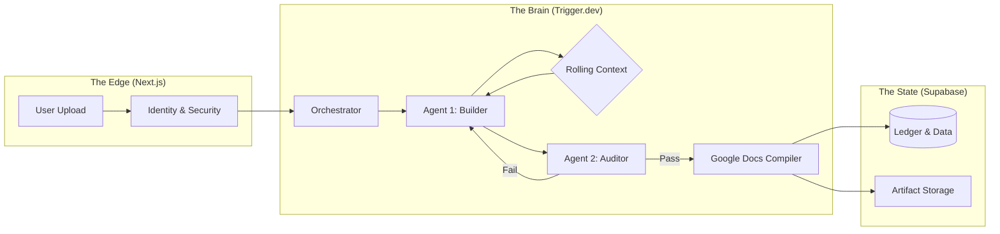

## System Demonstration

<Video
  playbackId="WNddSfv9LgR1KV01uf3sL02o02Lc9COwBWyr8rp7dsnceI"
  loop={false}
  muted={false}
  caption="Production workflow: From Scanned Document upload to Native Google Docs reconstruction."
  metadata={{
    video_title: "Verto: Vision-First Translation",
    video_id: "T2CAe4uR6BgTs2WIapkK02NeVIlZCi8EjICYe00cDmnbc"
  }}
/>

## 01. The Technical Constraint

The $30B translation industry has a hidden technical debt: **Layout Entropy**.

Standard OCR tools (AWS Textract, Tesseract) treat documents as unstructured "bags of words." While they extract text efficiently, they fail to preserve layout topology—breaking tables, merging headers, and displacing stamps.

**The Problem:** Sworn translators save 60 minutes on translation but lose 45 minutes *per document* manually reconstructing formatting in Microsoft Word.

**The Solution:** I architected **Verto**, a proprietary reconstruction engine. It does not just "read" text; it rebuilds the document's DOM (Document Object Model) pixel-perfectly in native Google Docs.

<Image
  src="/images/verto/review-editor.png"
  alt="Verto Review Editor Interface showing side-by-side comparison"
  caption="The Verto Editor: A side-by-side verification environment ensuring 100% layout fidelity compared to source."
  priority={true}
/>

---

## 02. System Architecture

The system is designed as an event-driven, stateful reconstruction pipeline. It prioritizes **Durable Execution** over simple request/response cycles.



### A. The "Auditor" (Adversarial Verification)

Generating JSON is easy; guaranteeing legal accuracy is hard. I implemented an **Adversarial Verification Loop** (Agent 2) that challenges the output of the reconstruction engine (Agent 1).

1. **Agent 1 (Builder)**: Generates the document DOM based on visual input.
2. **Agent 2 (Auditor)**: Performs pixel-level regression testing against the source image.
3. **The Loop**: If the Auditor detects a missing stamp or misaligned table border, it rejects the batch and forces a regeneration with higher attention weights on the failed region.

**Result:** A self-healing system that prioritizes accuracy over speed, crucial for the "Sworn Translation" market.

### B. The "Google Docs Bridge" (Custom Compiler)

The Google Docs API allows for programmatic document creation but requires strictly ordered `batchUpdate` requests. It does not accept HTML or raw text dumps.

I engineered a custom **Intermediate Representation (IR)** mapper (`GoogleDocsMapper`) that translates the AI's ProseMirror AST into specific Google Docs operations.

**The Hardest Problem: Virtual Grid Calculation**
Google Docs tables cannot be pasted; they must be constructed cell-by-cell. To handle complex legal tables with merged cells (`rowspan`/`colspan`), the system must "simulate" the table in memory before writing it.

```typescript
// src/lib/google-docs/mapper/virtual-grid.ts
// Complexity: O(n*m) where n=rows, m=cols.

// Core Logic: Resolving the Virtual Grid for Table Reconstruction
// This ensures 100% fidelity for complex legal tables.

for (let r = 0; r < node.content.length; r++) {
    for (const cell of row.content) {
        // Check collision with previous rowspan/colspan
        while (grid[r] && grid[r][c]) {
            c++;
        }
        // Register span for later API merge requests
        if (colspan > 1 || rowspan > 1) {
            spanMap.set(`${r},${c}`, { row: r, col: c, rowspan, colspan });
        }
    }
}

```

<Gallery
images={[
"/images/verto/dashboard-page.png",
"/images/verto/new-translation-page.png",
"/images/verto/translations-page.png",
"/images/verto/landing-page-blur.png",
]}
captions={[
"Executive Metrics: Aggregated volume, revenue, and efficiency stats.",
"Ingestion Wizard: Auto-detection of source language and layout types.",
"Global Queue: Real-time status tracking for concurrent translation jobs.",
"Public Gateway: Converting visitors with 'Language Barrier' value prop.",
]}
caption="The Core Platform: High-fidelity interfaces for management and ingestion."
/>

### C. Scalable Processing Pipeline

Processing 50+ page discovery files exceeds standard context windows. I implemented a **Rolling Context State Machine** that passes a `BatchContext` object between execution steps, enforcing semantic consistency across the entire file lifecycle.

The compute layer runs on **Trigger.dev** to achieve **Durable Execution**. If a job fails on Page 45, the system resumes from the last committed checkpoint rather than restarting.

<Gallery
images={[
"/images/verto/translation-details-page.png",
"/images/verto/pipeline-processing.png",
"/images/verto/templates-page.png",
]}
captions={[
"Job Inspector: Detailed metadata, token usage, and quality scores (95/100).",
"Job Visualization: Step-by-step progress from AI Vision to Google Docs Reconstruction (95% Confidence).",
"Schema Library: Pre-defined templates for standardized legal docs (e.g., Certificates).",
]}
caption="Process & Structure: Visualizing the deep-learning reconstruction pipeline."
/>

---

## 03. Infrastructure & Reliability

### The Double-Entry Ledger

To handle the "Per-Page" credit system, I rejected simple database increments. I implemented a **Double-Entry Ledger** in PostgreSQL.

* **ACID Compliance:** Every credit consumption is a transaction row, not a field update.
* **Race Condition Proof:** This architecture guarantees financial accuracy even when multiple heavy documents finish processing simultaneously.

<Gallery
images={[
"/images/verto/billing-page.png",
"/images/verto/transactions-filter-panel.png",
"/images/verto/top-up-page.png",
"/images/verto/customers-page.png",
"/images/verto/account-page.png",
]}
captions={[
"Client Portal: Usage tracking and consumption history.",
"Ledger Filters: Granular audit tools for transaction types (Purchase vs Consumption).",
"Credit Procurement: Tiered purchasing similar to API quota management.",
"Tenant Manager: User administration and organization roles.",
"Identity Management: Profile settings and MFA configuration.",
]}
caption="Admin & Operations: Zero-leakage credit management and security infrastructure."
/>

---

## 04. The Business Impact

Verto is currently in production, solving the "Layout Entropy" problem for real-world legal documents.

| Metric | Standard OCR | Verto Engine |
| --- | --- | --- |
| **Table Accuracy** | < 60% (Breaks on merges) | **100% (Virtual Grid Verified)** |
| **Formatting Time** | 45 Minutes / Doc | **< 2 Minutes (Review Only)** |
| **Success Rate** | ~85% (Timeouts on large files) | **99.9% (Durable Execution)** |
| **Output** | Static PDF | **Native, Editable Google Doc** |

---

## 05. Technology Matrix

This platform required a deep integration of Event-Driven Architecture and Modern Frontend Physics.

| Domain | Core Stack | Implementation Details |
| --- | --- | --- |
| **Frontend** | **Next.js 16** | React Server Components, Server Actions, Edge Runtime. |
| **UI System** | **Tailwind v4** | `shadcn/ui`, `framer-motion` (Shared Layout Animations). |
| **Editor** | **Tiptap** | Headless ProseMirror implementation with Custom Node Views. |
| **State** | **TanStack Query** | Optimistic UI updates synchronized via Supabase Realtime. |
| **Compute** | **Trigger.dev** | Long-running background jobs (24h max duration). |
| **Validation** | **Zod** | Strict schema validation for AI Structured Outputs. |
| **Payments** | **Stripe** | Webhook-driven Ledger synchronization. |

---

## 06. The Architectural Thesis

Verto proves that solving "Layout Entropy" requires treating documents as **Stateful Systems**, not static assets.

The value isn't in the AI model (which is a commodity); it is in the **Bridge** that makes that model compatible with the rigid physics of the real world (Google Docs, Legal Compliance, Auditors).

This project wasn't just about building a translation tool; it was about engineering a **Visual Compiler** that turns raw pixels into structured, legally binding data.
